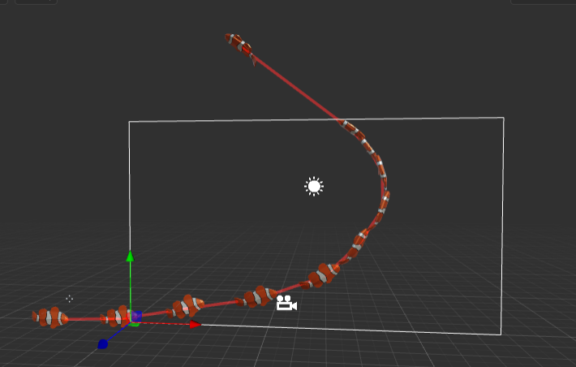
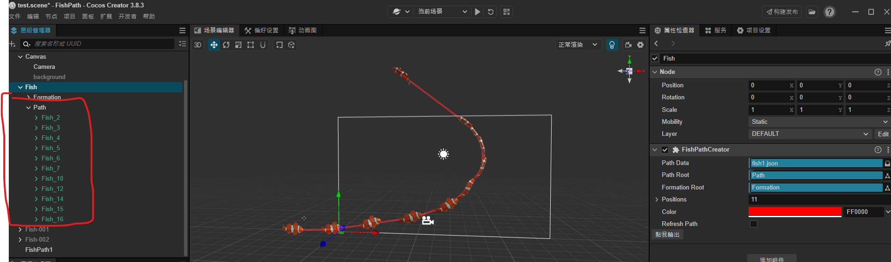
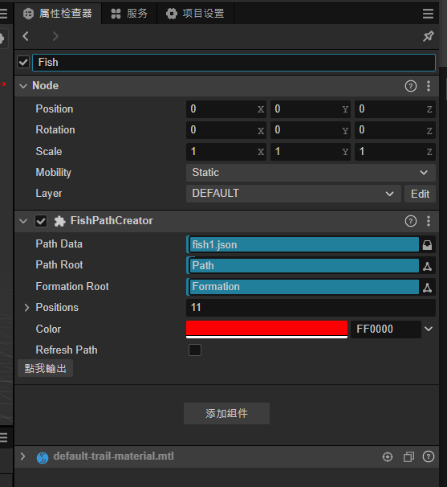
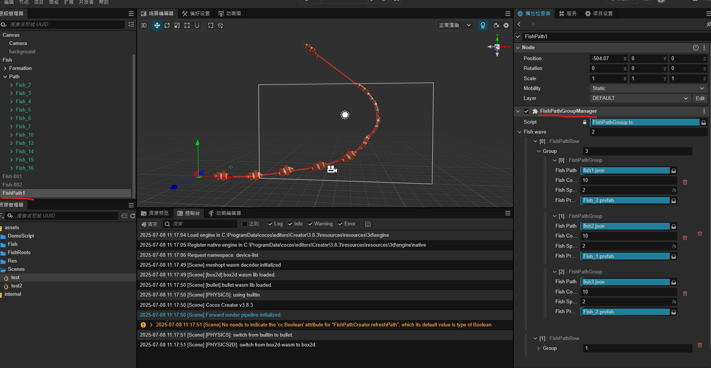

# FishProtoType
## FishDemo
### 遊戲框架概略
````
GameManager             :遊戲主要邏輯
├── ProbabilityManager  :機率產生器
├── Observer            :觀察者
├── CommData            :共用遊戲節點、 Function
├── TipManager          :提示
├── UserOperation       :使用者操作
├── ShootManager        :管理射擊邏輯
├── FishManager         :管理魚群
│   └── Fish            :魚
├── BulletManager       :子彈管理
│   └── Bullet          :子彈
└── Factory             :物件工廠
````

### 遊戲說明
- 模擬 JELI 射柱遊戲
- 前方為三個魚群生出點
- 主炮:忍者
- 砲彈:手裡劍
- 可以決定射擊單發、散射、射速
- 機率為單機版本RTP:0.98
```
遊戲連結:
https://storage.googleapis.com/ws-cocos-web-pdd5-slot-data/FishDemo/01/web-mobile/index.html
```
## FishPath
### Cocos creator 魚群路徑設定
- 操作方式
````
test.scene :Demo scene
目前僅開發階段；所以沒有使用Pool 所以繪製Draw Call 會偏高
````
### 範例圖片

### 操作方式-1
- 使用拖拉節點的方式

### 操作方式-2
- Path Data :設定腳本
- Path Root :節點Root
- ~~Formation :魚陣(暫時沒有使用到)~~
- Position :自動生成路徑(不用設定)
- Color :路徑顏色
- Refresh Path :刷新腳本
- 點我輸出 :輸出目前的腳本

### 操作方式-3
- Path Wave :魚波次
    - Group :波次魚陣
        - Fish Path :魚陣腳本
        - Fish Count :魚陣數量
        - Fish Spacing :魚陣間隔
        - Fish Prefab :使用的魚模型
